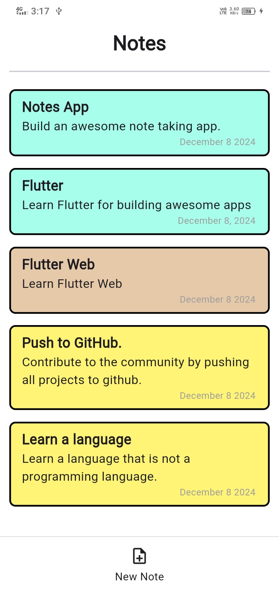

# 📝 Notes App

Welcome to the Notes App, a Flutter-based application that allows users to effortlessly manage their notes. Built with simplicity and efficiency in mind, this app uses **Hive**, a lightweight and fast key-value database for Flutter and Dart.

## Features 🌟

- **Beautiful UI Design**: A modern, intuitive design with multi-color cards ensures a delightful user experience.
- **Add Notes**: Create notes with customizable background colors to keep them organized and visually distinctive.
- **Edit Notes**: Update existing notes whenever needed.
- **Delete Notes**: Remove notes you no longer need.
- **Offline Support**: Access your notes anytime, anywhere.
- **Fast & Lightweight**: Powered by Hive for blazing-fast performance.

## Screenshots 📸

| **Home Screen** | **Add a Note** | **Manage Notes** |
|---|---|---|
|  |  |  |

## Installation 🛠️

Follow these steps to set up and run the Notes App on your local machine:

1. **Clone the repository:**

   ```bash
   git clone https://github.com/umarazizdev/Hive-Notes.git

2. **Navigate to the project directory:**
   ```bash
   cd Hive_Notes

3. **Install dependencies:**
   ```bash
   flutter pub get

4. **Run the app:**
   ```bash
   flutter run
 
 ##  Contributing 🤝
 Contributions are welcome! Please follow our contribution guidelines.
 ## Contact 📩
 For inquiries, please contact umar.aziz.dev@gmail.com.
 

